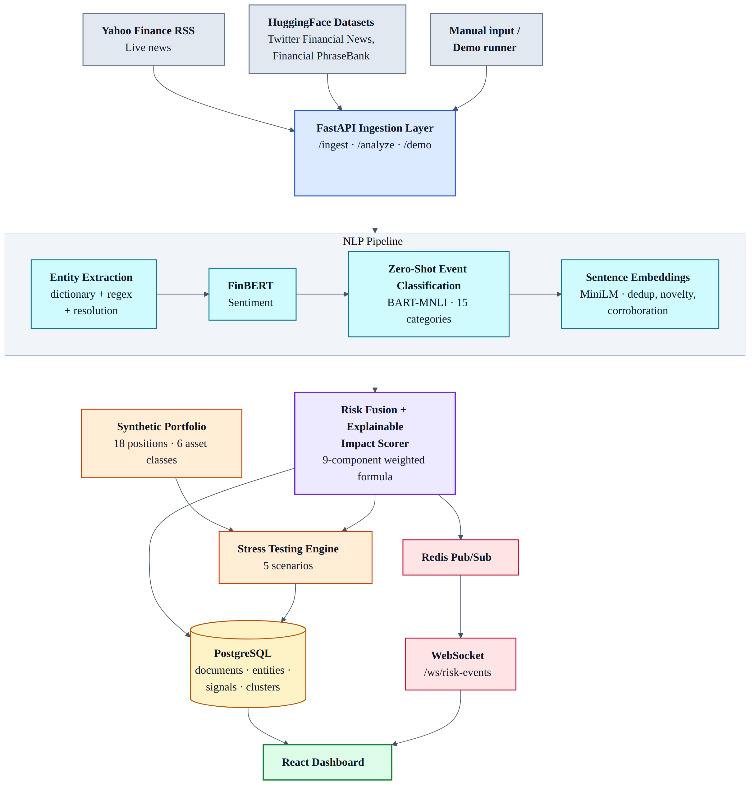
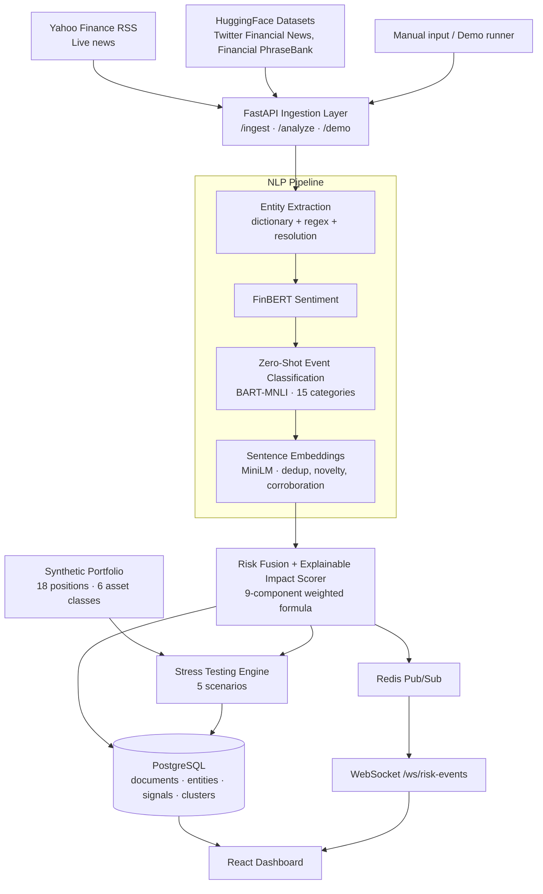

# FinRisk Intelligence - S&P Global & Crisil Campus Hackathon

> AI-powered financial risk intelligence platform for wholesale banking: real-time NLP event processing, explainable risk scoring, and portfolio stress testing.

| | |
|---|---|
| **Candidate Name** | Pulkit Agrawal |
| **College Email ID** | `your_id@vitbhopal.ac.in` *(replace with your college email)* |
| **College / Campus** | VIT Bhopal University |
| **Demo Video Link (YouTube, Unlisted)** | 🎥 **[PASTE YOUTUBE LINK HERE]** |
| **Slide Deck Link** | 📑 **[PASTE SLIDE DECK LINK HERE]** *(also available in the repo at [`/docs/presentation.pdf`](docs/presentation.pdf))* |
| **GitHub Repository** | https://github.com/PulkitAg13/VIT_Bhopal_University-Pulkit_Agrawal-Hackathon_ |

---

## Table of Contents

1. [Project Overview / Problem Statement & Approach](#1-project-overview--problem-statement--approach)
2. [Architecture & Tech Stack](#2-architecture--tech-stack)
3. [Dataset Used](#3-dataset-used)
4. [Quickstart & Installation](#4-quickstart--installation)
5. [Key Results & Domain Impact](#5-key-results--domain-impact)
6. [API Reference](#6-api-reference)
7. [Project Structure](#7-project-structure)
8. [Limitations & Next Steps](#8-limitations--next-steps)
9. [AI Usage Disclosure](#9-ai-usage-disclosure)
10. [License](#10-license)

---

## 1. Project Overview / Problem Statement & Approach

### The problem
Wholesale banking risk teams are flooded with unstructured information: news wires, social media, filings and market commentary. Most of it is noise, much of it is duplicated across sources, and the few items that really matter (a credit downgrade, a supply-chain shock, a regulatory action) can be buried or noticed too late. Analysts also need to understand *why* an event is flagged as risky and *what it would do to the bank's portfolio* before they can act on it. A black-box alert is not enough.

### Our approach
**FinRisk Intelligence** turns raw financial text into portfolio-aware, explainable risk signals in near real time:

1. **Ingest** financial text from live RSS feeds and replayable public datasets.
2. **Understand** each item with finance-specific NLP: sentiment (FinBERT), event type (zero-shot classification into a 15-category taxonomy) and entity extraction with entity resolution.
3. **De-duplicate and cluster** related items using sentence embeddings so one real-world event is not counted ten times. Clusters follow a lifecycle: `NEW → DEVELOPING → ESCALATING`.
4. **Score** each event with a transparent, 9-component weighted impact formula, including novelty and corroboration, with a **"Why this score?"** breakdown for every event.
5. **Stress test** a synthetic wholesale banking portfolio against 5 macro/credit scenarios and show asset-level impact across 6 asset classes.
6. **Stream** results to a React dashboard over Redis pub/sub and WebSockets for a live risk command center.

### What makes it different
- **Explainable by design:** every score can be decomposed into its components.
- **Event-centric, not article-centric:** clustering and corroboration reduce alert fatigue.
- **Config-driven:** entities, event taxonomy and stress scenarios live in YAML files in [`/config`](config/), so risk teams can change assumptions without touching code.
- **Runs on CPU:** no GPU required (it is used automatically if available).

---

## 2. Architecture & Tech Stack

### System design and data flow



> 📌 *High-resolution diagram: [`docs/architecture.png`](docs/architecture.png)*



### Layered view

```
┌─────────────────────────────────────────────────┐
│                    Frontend                     │
│  React + TypeScript + Vite + Recharts           │
│  Dashboard · Live Feed · Events · Entities      │
│  Portfolio · Stress Testing · Analytics         │
└──────────────────────┬──────────────────────────┘
                       │ HTTP / WebSocket
┌──────────────────────┴──────────────────────────┐
│                  Backend (FastAPI)               │
│  /analyze · /ingest · /events · /entities       │
│  /portfolio · /stress-test · /metrics · /demo   │
├─────────────────────────────────────────────────┤
│                  NLP Pipeline                   │
│  FinBERT sentiment · Zero-shot classification   │
│  Entity extraction · Sentence embeddings        │
│  Novelty · Corroboration · Impact scoring       │
├─────────────────────────────────────────────────┤
│                 Infrastructure                  │
│  PostgreSQL · Redis pub/sub · WebSocket         │
└─────────────────────────────────────────────────┘
```

### Tech stack

| Layer | Technologies |
|---|---|
| **Frontend** | React, TypeScript, Vite, Recharts, nginx (production serving) |
| **Backend** | Python, FastAPI, Pydantic, SQLAlchemy |
| **AI / ML** | HuggingFace Transformers, sentence-transformers, FinBERT, BART-MNLI |
| **Data / Messaging** | PostgreSQL, Redis (pub/sub), WebSockets |
| **Ingestion** | feedparser (RSS), HuggingFace `datasets` |
| **DevOps** | Docker, Docker Compose, Makefile |

### Models used

| Model | Purpose | Source |
|---|---|---|
| `ProsusAI/finbert` | Financial-domain sentiment | HuggingFace |
| `facebook/bart-large-mnli` | Zero-shot event classification (15 categories) | HuggingFace |
| `all-MiniLM-L6-v2` | Sentence embeddings for deduplication, novelty and corroboration | sentence-transformers |

### Why these choices
- **FinBERT** is trained on financial text, so it handles phrases like "beat expectations" or "covenant breach" far better than a generic sentiment model.
- **Zero-shot classification** lets the event taxonomy be changed in YAML with no retraining or labelled data.
- **Lightweight embeddings (MiniLM)** keep clustering fast on CPU.
- **Redis + WebSockets** give a push-based live feed rather than polling.
- **Docker Compose** makes the full stack (frontend, backend, PostgreSQL, Redis) reproducible with one command.

---

## 3. Dataset Used

> ⚠️ No proprietary or confidential client data (including any from S&P Global or Crisil) is used anywhere in this project.

### Sources

| Source | Type | Access method |
|---|---|---|
| Yahoo Finance RSS | Public, live | `feedparser` parses RSS XML |
| Twitter Financial News: Topic | Public dataset | HuggingFace `datasets` |
| Twitter Financial News: Sentiment | Public dataset | HuggingFace `datasets` |
| Financial PhraseBank | Public dataset | HuggingFace `datasets` |
| Synthetic wholesale banking portfolio | Synthetic (self-generated) | Built into `portfolio_service.py` |
| Entity table, event taxonomy, stress scenarios | Synthetic / hand-authored config | [`/config`](config/) |

Datasets are fetched with:

```bash
python scripts/download_datasets.py
```

Dataset details are documented in [`data/README.md`](data/README.md).

### Assumptions
- The **portfolio** is a synthetic **$100M, 18-position** wholesale banking book spanning **6 asset classes**. It is illustrative and not based on any real institution.
- **Stress scenarios** are hand-defined, with assumptions documented in `config/stress_scenarios.yaml`. Shock magnitudes are illustrative, not calibrated to regulatory scenarios.
- **Entity resolution** is dictionary + regex based (`config/entities.yaml`), so it only recognises entities that are in the table.
- Public social media and news text is used as a **proxy** for the kind of unstructured information a bank's risk team would monitor.
- Live RSS content changes over time, so results from live ingestion will differ between runs. Dataset replay is deterministic and is the best choice for reproducing results.

---

## 4. Quickstart & Installation

**Runtime:** Python 3.11, Node 20, Docker 24+ with Docker Compose v2 on **[OS tested, e.g. Windows 11 / Ubuntu 22.04]** *(edit to match your machine)*

**Hardware:** CPU is sufficient (GPU is used automatically if CUDA is available). About **4 GB RAM** and **~3 GB disk** are needed for model downloads on the first run.

### Option A: Docker Compose (recommended)

```bash
# 1. Clone the repository
git clone https://github.com/PulkitAg13/VIT_Bhopal_University-Pulkit_Agrawal-Hackathon_.git
cd VIT_Bhopal_University-Pulkit_Agrawal-Hackathon_

# 2. (Optional) create your env file from the template
cp .env.example .env

# 3. Build and start all services
docker compose up --build
```

| Service | URL |
|---|---|
| Frontend dashboard | http://localhost:3000 |
| Backend API | http://localhost:8000 |
| Interactive API docs (Swagger) | http://localhost:8000/docs |

> ⏳ The first start downloads the ML models (~3 GB), so it can take several minutes. Later starts are fast.

### Option B: Local development (without Docker)

PostgreSQL and Redis must be running and configured in `.env` (see `.env.example`).

```bash
# Terminal 1: Backend
cd backend
pip install -r requirements.txt
uvicorn app.main:app --reload --port 8000

# Terminal 2: Frontend
cd frontend
npm install
npm run dev
```

### (Optional) Download the datasets

```bash
pip install datasets
python scripts/download_datasets.py
```

### Quick verification

```bash
# Health check (database, Redis, models)
curl http://localhost:8000/api/v1/health

# Run the full end-to-end pipeline demo
curl -X POST http://localhost:8000/api/v1/demo/run
```

Then open http://localhost:3000 and explore the **Dashboard**, **Live Feed**, **Events**, **Portfolio** and **Stress Testing** pages.

### Suggested walkthrough (matches the demo video)

1. Open the **Dashboard** and review the risk command center.
2. Trigger the demo pipeline (`/api/v1/demo/run`) or ingest from Yahoo Finance RSS.
3. Watch events arrive on the **Live Feed** in real time.
4. Open an **Event Detail** page and read the **"Why this score?"** breakdown.
5. Inspect an **Entity** page for its risk timeline.
6. Go to **Portfolio** to see exposures, then run a scenario in **Stress Testing**.
7. Review distributions and trends in **Analytics**.

---

## 5. Key Results & Domain Impact

### What the prototype delivers
- **End-to-end NLP risk pipeline:** raw text becomes sentiment, event type, resolved entities, a cluster and an explainable impact score.
- **Event clustering with lifecycle tracking:** duplicate and related items collapse into one event that moves `NEW → DEVELOPING → ESCALATING`.
- **Explainable scoring:** a 9-component weighted formula with a per-event "Why this score?" view.
- **Portfolio stress testing:** 5 scenarios with asset-level impact across 6 asset classes on the synthetic portfolio.
- **Real-time delivery:** Redis pub/sub → WebSocket → live dashboard.
- **Persistence and analytics:** full PostgreSQL schema (sources, documents, entities, signals, clusters, portfolio, simulations) and a 16-endpoint REST API plus a WebSocket stream.

### Screenshots

<!-- Add screenshots to /docs/screenshots and uncomment the lines below -->
<!--
| Dashboard | Event Explainability |
|---|---|
|  |  |

| Portfolio Exposure | Stress Testing |
|---|---|
|  |  |
-->

### Efficiency vs. a naive approach

| Aspect | Naive approach | FinRisk Intelligence |
|---|---|---|
| Duplicate stories | Each article raises its own alert | Embedding-based clustering merges them into one event |
| Sentiment | Generic sentiment model | Finance-specific FinBERT |
| Event typing | Keyword rules or labelled training data | Zero-shot classification driven by a YAML taxonomy |
| Explainability | Opaque score | 9-component breakdown for every event |
| Portfolio link | Risk reviewed separately from news | Events and stress tests live in one platform |
| Delivery | Polling or manual refresh | Push-based live feed |

### Domain impact
- **Faster signal-to-decision time:** risk analysts see relevant events as they emerge instead of reading raw feeds.
- **Less alert fatigue:** clustering and corroboration surface what is new and confirmed.
- **Auditability and trust:** transparent scoring supports model-risk and governance expectations in regulated banking.
- **Forward-looking risk view:** stress tests connect market events to concrete portfolio impact.
- **Adaptable:** analysts can edit entities, event categories and scenario assumptions in config files, without code changes.

---

## 6. API Reference

Base URL: `http://localhost:8000` (interactive docs at `/docs`)

| Method | Endpoint | Description |
|---|---|---|
| GET | `/api/v1/health` | System health (DB, Redis, models) |
| POST | `/api/v1/analyze` | Run the full NLP + risk pipeline on text |
| POST | `/api/v1/ingest` | Fetch from sources and analyze |
| GET | `/api/v1/events` | List events (filters, pagination) |
| GET | `/api/v1/events/:id` | Event detail with explainability |
| GET | `/api/v1/entities` | List detected entities |
| GET | `/api/v1/entities/:id` | Entity detail with timelines |
| GET | `/api/v1/portfolio` | Portfolio positions |
| GET | `/api/v1/portfolio/exposure` | Portfolio exposure breakdown |
| GET | `/api/v1/stress-test/scenarios` | Available stress scenarios |
| POST | `/api/v1/stress-test` | Run a stress test on the portfolio |
| GET | `/api/v1/stress-test/results` | Stress test history |
| GET | `/api/v1/metrics` | Aggregated risk metrics |
| GET | `/api/v1/analytics/overview` | Full analytics with distributions |
| GET | `/api/v1/risk/timeline` | Risk trajectory data |
| POST | `/api/v1/demo/run` | Run the full pipeline demo |
| WS | `/ws/risk-events` | Real-time event stream |

---

## 7. Project Structure

```
├── backend/
│   ├── app/
│   │   ├── main.py                     # FastAPI app with lifespan
│   │   ├── models.py                   # SQLAlchemy ORM models
│   │   ├── schemas.py                  # Pydantic request/response schemas
│   │   ├── api/
│   │   │   ├── dependencies.py         # Service singletons
│   │   │   └── routes/                 # API route handlers
│   │   ├── core/
│   │   │   ├── config.py               # Env-driven settings
│   │   │   ├── database.py             # PostgreSQL engine/session
│   │   │   ├── model_manager.py        # ML model singleton manager
│   │   │   ├── redis_client.py         # Redis pub/sub client
│   │   │   └── logging.py              # Structured logging
│   │   └── services/
│   │       ├── nlp/                    # sentiment, event_classifier, entity_extractor
│   │       ├── risk/                   # risk_fusion, impact_scorer
│   │       ├── stress/                 # stress_engine
│   │       ├── portfolio/              # portfolio_service
│   │       └── ingestion/              # RSS + dataset + demo sources
│   ├── Dockerfile
│   └── requirements.txt
├── frontend/
│   ├── src/
│   │   ├── App.tsx                     # Shell with sidebar routing
│   │   ├── api/client.ts               # Typed API client
│   │   ├── pages/                      # Dashboard, LiveFeed, Events, EventDetail,
│   │   │                               # Entities, EntityDetail, Portfolio,
│   │   │                               # StressTesting, Analytics, SettingsPage
│   │   └── index.css                   # Design system
│   ├── Dockerfile
│   └── nginx.conf
├── config/
│   ├── entities.yaml                   # Entity resolution table
│   ├── event_taxonomy.yaml             # 15-category event taxonomy
│   └── stress_scenarios.yaml           # 5 stress scenarios + assumptions
├── scripts/
│   └── download_datasets.py            # HuggingFace dataset downloader
├── data/                               # Dataset documentation and sample data
├── docs/
│   ├── presentation.pdf                # 5-7 slide deck
│   ├── architecture.png                # Architecture diagram
│   └── implementation_audit.md         # Technical audit report
├── docker-compose.yml                  # Full-stack orchestration
├── Makefile
├── .env.example
└── LICENSE                             # MIT
```

---

## 8. Limitations & Next Steps

### Current limitations
- Entity extraction is dictionary + regex based and misses entities not in `entities.yaml`.
- Zero-shot classification on CPU is slower than a fine-tuned lightweight classifier.
- Stress scenarios are illustrative and not calibrated to regulatory frameworks.
- The portfolio is synthetic and small (18 positions), so results show the mechanism rather than real-world magnitudes.
- Public social and news text is a proxy for the data a real bank would use.
- Event impact scores have not been back-tested against realised market or credit outcomes.

### Next steps
- Replace dictionary entity extraction with a fine-tuned financial NER model plus a knowledge-graph-based resolver.
- Fine-tune a smaller event classifier from the zero-shot outputs to cut latency.
- Link events to specific portfolio positions and counterparties for event-driven exposure alerts.
- Back-test impact scores against historical events and calibrate the weights.
- Add more sources (regulatory filings, earnings transcripts) and multilingual support.
- Add authentication, role-based access and alert routing (email / Slack) for production use.

---

## 9. AI Usage Disclosure

In line with the hackathon's integrity guidelines: AI assistance was used while building and documenting this project, and I take full responsibility for the final submission. The NLP models listed above are open-source pre-trained models used under their respective licenses.

---

## 10. License

Released under the [MIT License](LICENSE).

---

<p align="center">
  <b>FinRisk Intelligence</b> · Built by Pulkit Agrawal · VIT Bhopal University<br/>
  S&P Global & Crisil Campus Hackathon 2026
</p>
